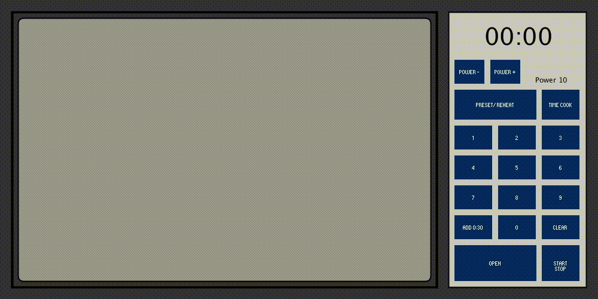
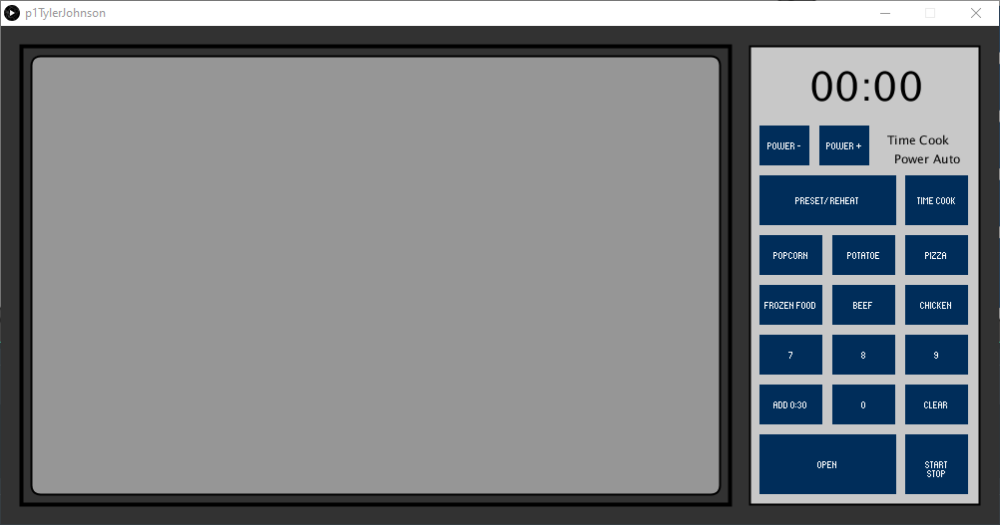

# Tyler Johnson - CS 5331 - Project 1

[Github Page](https://tylermackj.github.io/p1TylerJohnson/)

[Youtube Presentation](https://youtu.be/q6YBKWSxpA0)

## My Microwave

I chose to go with the microwave in my apartment which is shown below.

### Issue

When using the reheat function on the microwave, it allows you to pick a reheat preset. This issue with this is how you select a preset. You are supposed to click one of the numbers which will then make the screen display the preset name. For example: 1 is used to reheat pasta, and 2 is used to reheat meat. Unless you remember all the preset options, you have to click them all one by one in order to determine all the options.

In order to fix this issue, it would be nice to have the buttons slightly more spaced apart and each one includes the reheat option in small letters.

## Common Uses

#### Setting the Time

When using the microwave normally, most people will type in the time they would like the microwave to run for. This is quite simple through clicking 'time cook' and typing in the amount of time. The microwave speeds this process up for standard times down to 30 second accuracy. This is because, if you do not press time cook, and select number x. That will automatically start the microwave for x minutes. Then if you need more time, or want to add 30 seconds, there is a dedicated button.

#### Presets

This microwave also includes the presets popcorn, beverage, potatoe, and the problematic reheat presets. I personally only regularly use the popcorn button, and I find the front and center button very easy to use.

### Uncommon Uses

#### Reheating

Although I already talked about the issues with the reheating menu, I would like to mention that the reheating option is nice to include. I am not sure if all microwaves are like this but, in my experience, it seems my microwave changes the power level for a better reheating. 

#### Power Level

When using the power level, I have came to found you need to have selected time cook first or else it won't allow you to change the level. Additionally, the power level automatically changes back to 10 when it is done cooking. 10 is the standard but the microwave does not make that change clear.

## My Touchscreen Microwave

### Changes and Thoughts

During implementation I decided to focus on making the most often tasks the easiest to perform while leaving quick access to additional features. I also tried to provide the user as much info as possible.

First, you can see that the numbers are prominent as they are the main buttons a user will click. I left the operation similar to my current microwave such that, if you click the numbers it will use that as a number of minutes. To type in a specfic time you must click time cook first. The reasoning behind this is the same reason I praised it on my current microwave. Additionally, there is text to show the user if they are in time cook mode or not.

I also fixed the issues I found with the preset and reheat options. When the user selects that mode it changes a series of numbers into options and changes the power level to auto.

Continuing about the power level, I made sure to leave the text on the screen so that any use can quickly see what the power level is and use it if they wish.

### Comments

The microwave in processing is closed by clicking the open button again. This was just a quick implentation as there is no physical door to shut by hand.

The grey area in the middle is supposed to represent a window into the microwave and there is a black outline of the actual door. When the user clicks the open button the white inside of the microwave is represented by the white space.
